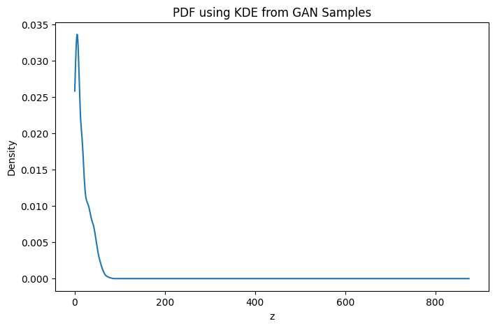

# Assignment–2: Learning PDF using GAN

## Objective
The objective of this assignment is to learn the probability density function (PDF) of a random variable using only data samples. No analytical probability distribution is assumed. A Generative Adversarial Network (GAN) is used to implicitly learn the underlying distribution.

## Dataset
The dataset used is India Air Quality Data from Kaggle. Only the NO₂ concentration values are considered for this assignment. Missing values are removed before further processing.

## Transformation Parameters
Each NO₂ value `x` is transformed into a new variable `z` using the equation:

z = x + a_r * sin(b_r * x)

For roll number r = 102303961:
- r mod 7 = 4  →  a_r = 0.5 × 4 = **2.0**
- r mod 5 = 1  →  b_r = 0.3 × (1 + 1) = **0.6**

Hence, the final transformation used is:

z = x + 2.0 * sin(0.6 * x)

## GAN Architecture Description

### Generator
- Input: Random noise sampled from a normal distribution N(0,1)
- Architecture: Fully connected neural network with layers (1 → 16 → 16 → 1)
- Activation Function: ReLU in hidden layers

### Discriminator
- Input: Real transformed samples or generated samples
- Architecture: Fully connected neural network with layers (1 → 16 → 8 → 1)
- Activation Function: ReLU in hidden layers and Sigmoid in output layer

Binary cross-entropy loss and Adam optimizer are used to train both networks.

## PDF Plot from GAN Samples
After training the GAN, a large number of samples are generated using the generator. The probability density function of the generated samples is estimated using:
- Histogram density estimation
- Kernel Density Estimation (KDE)
  

## Observations

### Mode Coverage
The generator captures the major modes of the transformed data distribution, though small-scale variations are slightly smoothed.

### Training Stability
GAN training shows the expected adversarial loss oscillations but remains stable after the initial training phase.

### Quality of Generated Distribution
The generated samples closely follow the overall shape of the real transformed distribution, indicating successful learning of the underlying probability density.

## Conclusion
This assignment demonstrates that a GAN can effectively learn an unknown probability density function using only data samples, without assuming any parametric form.
