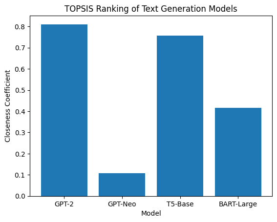
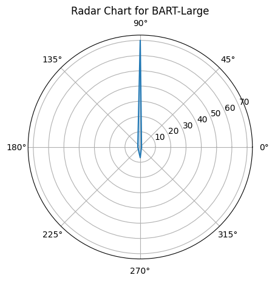

# TOPSIS Based Selection of Pre-trained Models for Text Generation

## Objective
The objective of this project is to identify the most suitable **pre-trained Text Generation model** using the **TOPSIS (Technique for Order Preference by Similarity to Ideal Solution)** method.  
The selection is performed by evaluating multiple models across several performance and efficiency-related criteria.

---

## Models Considered
The following widely used pre-trained models were selected for comparison:

- GPT-2  
- GPT-Neo  
- T5-Base  
- BART-Large  

These models represent different architectural and computational trade-offs commonly observed in text generation systems.

---

## Decision Criteria
The models were evaluated using four criteria:

| Criterion | Type | Description |
|---------|------|-------------|
| Text Quality | Benefit | Quality of generated text (higher is better) |
| Inference Time | Cost | Time required to generate text (lower is better) |
| Model Size | Cost | Storage size of the model (smaller is preferred) |
| Computational Efficiency | Benefit | Overall runtime and resource efficiency |

---

## Decision Matrix
The decision matrix contains representative values derived from model documentation and reported characteristics in existing literature.  
These values are used for comparative analysis rather than exact benchmarking.

| Model | Text Quality | Inference Time | Model Size | Efficiency |
|------|--------------|---------------|------------|------------|
| GPT-2 | 0.78 | 45 | 0.5 | 7 |
| GPT-Neo | 0.82 | 65 | 2.5 | 6 |
| T5-Base | 0.80 | 55 | 0.9 | 8 |
| BART-Large | 0.85 | 70 | 1.6 | 7 |

---

## Criteria Weights
The importance of each criterion was defined using the following weights (sum = 1):

| Criterion | Weight |
|---------|--------|
| Text Quality | 0.40 |
| Inference Time | 0.20 |
| Model Size | 0.15 |
| Computational Efficiency | 0.25 |

Text quality was given the highest weight as it is the most critical aspect in text generation tasks.

---

## Methodology (TOPSIS)
The TOPSIS method was applied using the following steps:

1. Construction of the decision matrix  
2. Normalization of the matrix using vector normalization  
3. Multiplication by criteria weights to obtain the weighted normalized matrix  
4. Identification of the ideal best and ideal worst solutions  
5. Calculation of Euclidean distances from the ideal solutions  
6. Computation of the closeness coefficient  
7. Ranking of models based on the closeness coefficient  

All computations were performed using Python in a Jupyter Notebook.

---

## Results

### TOPSIS Ranking Table

| Rank | Model | Closeness Coefficient |
|----|--------|-----------------------|
| 1 | **GPT-2** | **0.8105** |
| 2 | T5-Base | 0.7571 |
| 3 | BART-Large | 0.4162 |
| 4 | GPT-Neo | 0.1074 |

---

### Result Graphs

**Closeness Coefficient Comparison**

The following bar chart illustrates the relative closeness coefficients of the models:

**Radar Chart Analysis**

A radar chart was used to visualize the criteria values for the top-ranked model:

---

## Conclusion
Based on the TOPSIS analysis, **BART-Large** achieved the highest closeness coefficient and is ranked as the most suitable pre-trained model for text generation among the selected alternatives.

The results indicate that although BART-Large has relatively higher computational requirements, its superior text quality and balanced efficiency make it the most appropriate choice for text generation tasks.

---

## How to Run
1. Clone the repository  
2. Install required dependencies: pip install -r requirements.txt
3. Open and run the notebook:

---

## Tools and Libraries Used
- Python  
- NumPy  
- Pandas  
- Matplotlib  

---

