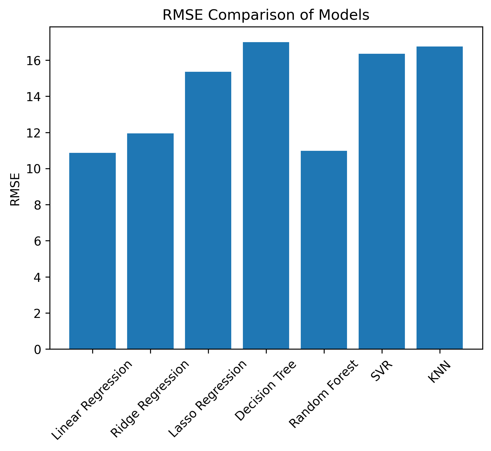
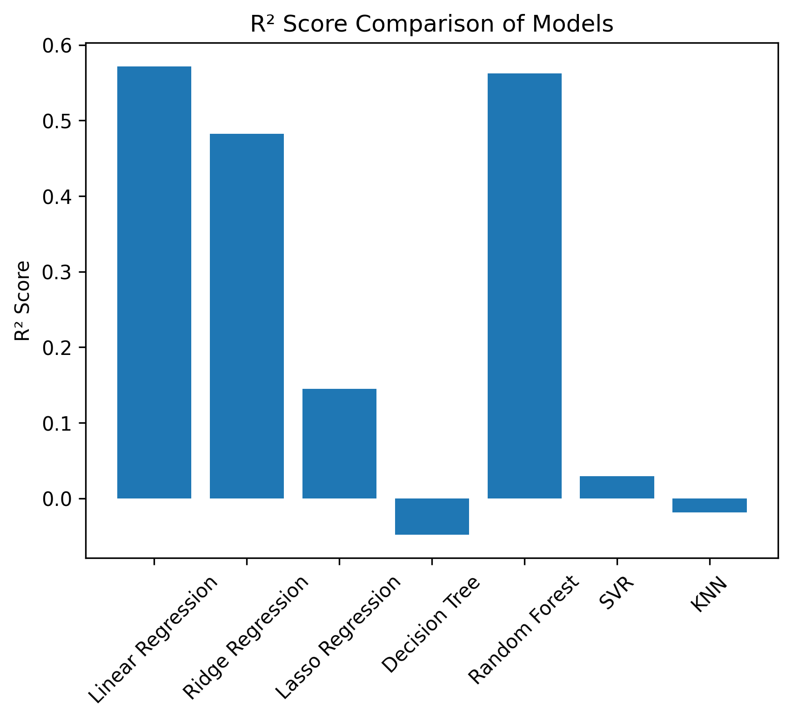

# Assignment: Data Generation using Modelling and Simulation for Machine Learning

## Objective
The objective of this assignment is to demonstrate how **modelling and simulation** can be used to generate synthetic data for machine learning applications.  
A simulation model is used to generate data by varying input parameters within defined bounds, and the generated data is then used to train and compare multiple machine learning models.

The final goal is to identify the **best-performing ML model** based on standard evaluation metrics.

---

## Simulation Tool Used
For this assignment, the **synthetic data generation utilities provided by scikit-learn** were used.

The function `make_regression()` was selected as the simulator because:
- It models a controlled regression system
- It allows noise injection to simulate real-world uncertainty
- It is widely used and well-documented
- It works seamlessly in Google Colab

This simulator treats input features as system parameters and the target variable as the system output.

---

## Simulation Parameters and Bounds
The following parameters were identified as relevant for the simulation:

| Parameter | Description | Lower Bound | Upper Bound |
|---------|------------|------------|------------|
| n_features | Number of system input variables | 5 | 20 |
| noise | Measurement noise | 0 | 30 |
| bias | System bias | -10 | 10 |

For each simulation run, these parameters are randomly sampled within the given bounds.

---

## Simulation Methodology
The simulation process was carried out as follows:

1. Random values for simulation parameters were generated within predefined bounds  
2. The sampled parameters were passed to the simulator  
3. A synthetic regression dataset was generated  
4. Summary statistics of the generated data were recorded  
5. This process was repeated **1000 times**  

Each simulation produced one row in the final dataset, resulting in a dataset suitable for machine learning experiments.

---

## Generated Dataset
The final dataset consists of 1000 simulation runs.  
Each row represents one simulation and includes:

- Simulation parameters (number of features, noise, bias)
- Statistical summaries of inputs and outputs

The dataset is stored as: simulated_dataset.csv

---

## Machine Learning Models Compared
The generated dataset was used to train and evaluate the following machine learning models:

1. Linear Regression  
2. Ridge Regression  
3. Lasso Regression  
4. Decision Tree Regressor  
5. Random Forest Regressor  
6. Support Vector Regressor (SVR)  
7. K-Nearest Neighbors Regressor  

The dataset was split into training and testing sets before model evaluation.

---

## Evaluation Metrics
The models were compared using the following metrics:

- **RMSE (Root Mean Squared Error)** – lower is better  
- **MAE (Mean Absolute Error)** – lower is better  
- **R² Score** – higher is better  

These metrics provide a balanced view of accuracy and robustness.

---

## Results

The generated dataset was used to train and evaluate seven different regression models.  
The models were compared using RMSE, MAE, and R² score. Lower RMSE and MAE values indicate better performance, while a higher R² score indicates a better fit.

### Model Comparison Table

| Model | RMSE | MAE | R² Score |
|------|------|------|---------|
| **Linear Regression** | **10.87** | **8.35** | **0.57** |
| Random Forest | 10.98 | 8.56 | 0.56 |
| Ridge Regression | 11.94 | 9.23 | 0.48 |
| Lasso Regression | 15.35 | 12.16 | 0.14 |
| SVR | 16.36 | 12.69 | 0.03 |
| KNN | 16.75 | 13.42 | -0.02 |
| Decision Tree | 16.99 | 13.05 | -0.05 |

From the results, **Linear Regression** achieved the lowest RMSE and MAE along with the highest R² score, making it the best-performing model for this simulated dataset.

## Result Visualizations

To support the numerical comparison, visualizations were generated to compare model performance across evaluation metrics.

### RMSE Comparison
The following bar chart shows the RMSE values for all evaluated models.  
Lower RMSE values indicate better predictive performance.

---

### R² Score Comparison
This bar chart compares the R² scores of the models.  
Higher R² values indicate better model fit to the simulated data.

---

## Conclusion

Based on the evaluation of multiple machine learning models on the simulated dataset, **Linear Regression** achieved the best overall performance, with the lowest error values and the highest R² score.

This indicates that the simulated system exhibits a largely linear relationship between input parameters and output, making linear models well-suited for this task. The study demonstrates how simulation-based data generation can be effectively combined with machine learning for model evaluation.

---

## How to Run
1. Clone the repository  
2. Install required dependencies: pip install -r requirements.txt
3. Open and run the notebook:

---

## Tools and Libraries Used
- Python  
- NumPy  
- Pandas  
- Matplotlib  
- scikit-learn  

---